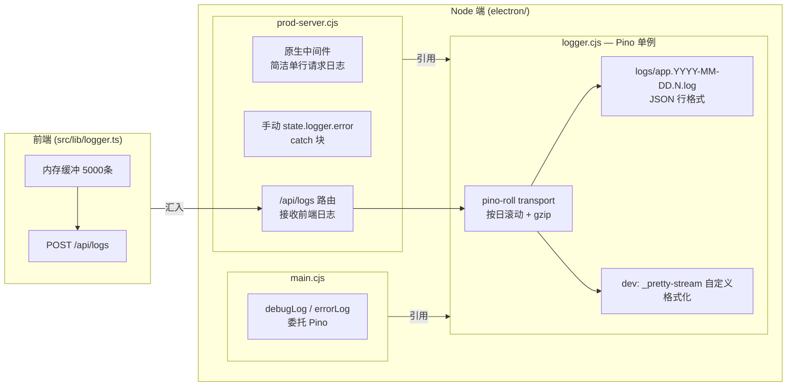

# 🌍 地球 Online 生存日记

> 以「地球 Online 玩家」的身份管理生活，3D 可视化呈现你的生存轨迹。

一款将游戏化概念融入日常时间管理的跨平台应用。记录足迹、管理任务、专注计时、规划课程 — 所有数据存储在本地，隐私安全可控。

## ✨ 功能模块

| 模块 | 说明 |
|------|------|
| 👣 足迹记录 | 记录每日活动与日记，上午/下午/晚上三列并排展示，星标全宽置顶；卡片按钮始终可见且独立配色 |
| 📝 笔记 | 自研 Markdown 编辑器，左侧大纲导航，支持幻灯片放映 |
| ⏱️ 专注计时 | 番茄钟与正计时，完成后自动生成足迹 |
| 📋 清单 | 智能清单与任务管理，支持分组、优先级、重复任务；卡片按钮始终可见且独立配色 |
| 🚀 倒数日 | 重要日期追踪，系统自动生成节日倒数日 |
| 📚 课程表 | 教学周与节次管理，自动课程提醒 |
| 📊 统计 | ECharts 图表展示时间分布 |
| 🧰 工具箱 | 数据导入导出、插件入口 |
| 🔌 插件系统 | 可扩展插件，市场托管在独立仓库 |

应用内置新手引导（首次启动自动播放）与应用内「使用指南」笔记（笔记模块 → 攻略分类），README 侧重开发相关内容。

## 🔌 插件市场

应用内置社区插件市场，可在工具箱页面查看与安装。插件列表托管在独立仓库：[XueWerY/plugin-marketplace](https://github.com/XueWerY/plugin-marketplace)

## 🖥️ 支持平台

- **Windows** — Electron 桌面端
- **Android** — Capacitor 移动端

## 🛠️ 技术栈

- **前端**：Vue 3 + TypeScript + Composition API + Pinia + Vue Router
- **UI**：Element Plus + 深色星空主题
- **3D 可视化**：Three.js（NASA 卫星纹理地球、月球、太阳，Canvas 流星粒子动画）
- **编辑器与图表**：自研 Markdown 编辑器 · ECharts · lunar-javascript（农历）
- **跨平台**：Electron（桌面）+ Capacitor（Android）
- **日志**：Pino + pino-roll（按日滚动 + gzip）+ 自定义 _pretty-stream 格式化，含持久化提醒调度器
- **构建**：Vite + electron-builder

## 🚀 开发环境

### 基础环境

- Node.js 18+（推荐 20 LTS）
- pnpm（`npm install -g pnpm`）
- TypeScript 5.8+（随项目依赖安装）

```bash
# 安装依赖
pnpm install
```

Electron 端依赖在 `electron/` 目录通过 `electron/package.json` 管理，由构建脚本 `install-deps` 步骤自动安装。

### 浏览器端开发（最快）

适合日常 UI 与逻辑调试。数据通过 Capacitor Filesystem Web 兜底实现存储到浏览器 IndexedDB。

```bash
npx vite
```

- Chrome DevTools（F12）断点、Network、IndexedDB 查看
- Vue DevTools 浏览器插件查看组件树与 Pinia 状态
- Vite 自动 HMR，无需手动刷新
- **注意**：浏览器端无法调试 Electron 主进程，Electron 相关改动需在桌面端验证

### Electron 桌面端开发

`pnpm dev` 同时启动 Vite dev server（端口 5173）和 Electron（内置 Express 服务端口 5000），主窗口加载 Vite dev server，`/api` 请求经 Vite proxy 转发回 Express。

```bash
pnpm dev
```

| 改动类型 | 行为 |
|----------|------|
| `src/**/*.vue`、`src/**/*.ts` | Vite HMR 即时刷新页面，不重启 Electron |
| `electron/**/*.cjs`（主进程 / preload / Express） | `scripts/dev.cjs` 监听文件变化，杀掉 Electron 进程树（`taskkill /T /F`）后重新拉起 |

主进程日志输出到终端与 `userData/logs/app.YYYY-MM-DD.N.log`，渲染进程可通过 `mainWindow.webContents.openDevTools()` 打开 DevTools。

### Android 端开发

```bash
pnpm build
npx cap sync android
# 然后用 Android Studio 打开 android/ 编译运行
```

### 注意事项

- 浏览器端与 Electron 端数据存储相互隔离，不互通
- `vite.config.ts` 中 `base: './'` 确保打包后资源路径正确，请勿修改
- `virtual:version` 虚拟模块在构建时从 `package.json` 注入版本号

## 📁 项目结构

```
earth-survival-diary/
├── src/                        # 前端源码
│   ├── components/             # Vue 组件（按模块组织）
│   │   ├── auth/               #   认证页面
│   │   ├── common/             #   通用组件（nav、card、overlay、picker）
│   │   ├── ui/                 #   通用 UI 组件（BaseDialog、ColorGrid）
│   │   ├── editor/             #   MarkdownEditor
│   │   ├── timer/              #   FloatingTimerBar
│   │   ├── countdown/          #   倒数日
│   │   ├── course/             #   课程表
│   │   ├── focus/              #   专注计时
│   │   ├── footprint/          #   足迹记录
│   │   ├── list/               #   清单
│   │   ├── notes/              #   笔记
│   │   ├── profile/            #   个人中心
│   │   ├── statistics/         #   统计
│   │   └── toolbox/            #   工具箱
│   ├── composables/            # 组合式函数
│   ├── data/                   # 静态数据（引导步骤、使用指南 Markdown）
│   ├── lib/                    # 工具库（API、存储、日志、文件系统、插件桥接）
│   ├── plugins/                # 插件系统（Vite glob 加载）
│   ├── router/                 # 路由配置
│   ├── services/               # 存储服务（storageService）
│   ├── stores/                 # Pinia 状态管理
│   ├── types/                  # 类型声明（含 electron.d.ts IPC 类型）
│   ├── App.vue                 # 根组件
│   └── main.ts                 # 入口文件
├── electron/                   # Electron 主进程
│   ├── main.cjs                #   入口，IPC handler、窗口管理、子进程
│   ├── preload.cjs             #   contextIsolation 桥接，window.electronAPI
│   ├── prod-server.cjs         #   内置 Express 服务器
│   ├── lib/logger.cjs          #   Pino 单例 + pino-roll transport + _pretty-stream 自定义格式化
│   └── build-plugin.cjs        #   插件系统编译（esbuild）
├── android/                    # Android (Capacitor)
├── scripts/                    # 构建工具脚本（dev.cjs、build-tools.cjs、generate-icons.js）
├── build/                      # 图标资源（app-icon.png 源文件）
├── public/                     # 静态资源
└── package.json                # 项目配置
```

## 📐 技术架构

### 主进程能力（IPC）

渲染进程与插件**不得直接使用 Node 能力**（`contextIsolation: true` / `nodeIntegration: false`），所有系统能力统一由 `electron/preload.cjs` 挂到 `window.electronAPI`，实现放在 `electron/main.cjs` 的 `ipcMain.handle`，类型在 `src/types/electron.d.ts` 同步声明（三处需一并修改）。

主要 IPC：

| IPC | 说明 |
|-----|------|
| `execPowerShell(command)` | 执行 PowerShell 命令，stdout/stderr 经 `powershell-output` 事件流式回推；主进程已统一 UTF-8 编码 |
| `startSnowbaby` / `stopSnowbaby` | snowbaby 常驻进程管理（`child_process.spawn('node', ['app.js'])`，注入 `ESD_DATA_DIR`，`taskkill /T` 停止） |
| `napcat*` 系列 | NapCat Shell 手动版管理（get/status/download/install/start/stop/update/uninstall/checkQQ），仅 Windows AMD64 |
| `openDirectory()` | 系统目录选择对话框（NapCat 手动指定 QQ 安装目录用） |
| `httpGetJson(url)` / `httpGetText(url)` | 主进程发起 HTTPS 请求（绕开渲染进程同源策略）；插件市场下载 GitHub 源文件统一走此通道 |
| 日志 IPC | `get-log-file-size` / `get-log-content` / `clear-logs`（适配 pino-roll 滚动文件） |

### 插件系统架构

- 仅支持 Electron 端，以源码形式分发（插件市场从 GitHub 下载源码），**不打包进 exe**
- **开发模式**：`src/lib/pluginLoader.dev.ts` 通过 Vite glob 加载 `src/plugins/<插件ID>/`
- **生产模式**：插件安装到 `userData/plugins/<插件ID>/`；应用启动时主进程用 esbuild 打包为单文件 ESM（`dist/<工具ID>.js`），渲染端经 Express `/api/plugins/<插件ID>/dist/<工具ID>.js` 动态导入
- **运行时桥**：共享依赖（vue / pinia / element-plus / 应用内部模块等）**不打包进插件产物**，由 `src/lib/pluginBridge.ts` 暴露到 `window.__ESD_BRIDGE__`，保证插件与主应用共用同一实例
- **桥接白名单**：新增可桥接模块需同步修改 `electron/build-plugin.cjs`（`BARE_BRIDGE` / `SRC_BRIDGE`）与 `src/lib/pluginBridge.ts` 两处，键名必须与插件内实际 import 路径一致
- 编译标记 `dist/.compiled` 内容版本化（`main.cjs` `COMPILED_TAG`），打包器变更时递增强制重编译

```
<插件ID>/
├── plugin.json                 # manifest + tools 元数据
├── index.ts                    # 仅开发模式（Vite glob）使用
├── tools/<工具ID>/index.vue    # 工具组件（script setup）
└── dist/                       # 生产模式启动时自动生成
    ├── <工具ID>.js
    └── .compiled               # 编译标记（内容 = COMPILED_TAG）
```

## 📝 日志系统

主进程与 Express 服务共用一个 Pino 单例（`electron/lib/logger.cjs`），前端 `src/lib/logger.ts` 保持原样（经 POST `/api/logs` 汇入同一 Pino 实例）。

### 架构



### 行为

| 模式 | 级别 | 输出 |
|------|------|------|
| dev（`ESD_DEV_URL` 存在） | `debug` | pino-roll 文件 + _pretty-stream 彩色格式化 stdout（自定义格式） |
| prod | `info` | 仅 pino-roll 文件（无 stdout target） |

- **Express 请求**：原生中间件 `res.on('finish')` 捕获，输出简洁单行 `[HTTP] 接口 POST /api/xxx 返回 200 (2ms)`；跳过 `/api/health` 高频轮询
- **滚动策略**：pino-roll 按日生成 `app.YYYY-MM-DD.N.log`，旧文件自动 gzip 压缩
- **日志查看**：Toolbox → Logs，底层用 findLatestLogFile() 取最新文件


- **stdout 格式化（dev only）**：自定义 `_pretty-stream.cjs` Transform stream，格式为
  ```
  [HH:mm:ss.l] [LEVEL ] [  名称  ] 消息内容
  ```
  三段独立颜色（时间灰、级别各有、名称蓝），级别标签 padEnd 5、名称段居中 pad 12
  后再包 `[]`，名称从 msg 中正则提取 `/^\[([^\]]+)\]\s*/`

### 提醒调度系统

| 组件 | 位置 | 说明 |
|------|------|------|
| 持久化存储 | `userData/data/<userId>/system/reminders.json` | JSON 文件，防抖 3 秒落盘 |
| ticker 扫描器 | main.cjs `scanDueReminders()` | 每 60s 扫存储，捡 5 分钟内到期的注册 setTimeout |
| 双通道触发 | main.cjs `showNextReminder()` | 主窗口可见 → 应用内弹窗，否则 → `new Notification()` 系统通知 |
| 循环提醒 | main.cjs `scheduleNextRepeat()` | 触发后写存储让 ticker/setTimeout 自动捡 |
| 启动恢复 | main.cjs `initReminderSystem()` | 读 JSON + 补触发期间过期提醒 |
| 退出保险 | `before-quit` | `cancelAllReminderTimers()` + `stopTicker()` + `persistReminders()` |

## 🎨 UI/UX 规范

### 视觉风格

- **配色**：深色星空背景、蓝紫渐变（`#667eea`）、琥珀强调（`#fbbf24`）
- **文字**：rgba 白色透明度梯度，深色背景下 clear 可读
- **3D 场景层级**：Canvas 流星画布 z-index 必须低于 Three.js 元素（地球、月球、太阳）

### 布局

- 面包屑地址栏导航，支持下拉快速切换模块
- 卡片网格布局，响应式列数（全局最多 6 列；清单页、倒数日页、课程表列表视图例外：最多 3 列，卡片间距与左右边界留白均为 25px）
- 支持分屏显示（左右双面板，`splitActive` 状态下每个面板含独立导航区）

### 交互

- 卡片右上角 hover 显示操作按钮
- 下拉菜单使用固定定位 + backdrop-filter 模糊背景
- 确认操作使用 `ConfirmDialog`，消息提示使用 `ElMessage`

### 常用组件

| 组件 | 说明 |
|------|------|
| `MainNav` | 全局导航栏。桌面端左侧导航区（`variant="left"`，宽度 120px，底部可收起为窄栏）；移动端底部导航栏（`variant="bottom"`，距页面下边界 25px 透明浮层）；长按左键 ~0.3s 进入滑动模式；导航项末尾提供「拆分」入口（`variant="split"`，flex-start 布局便于溢出滚动） |
| `BaseDialog`（`components/ui/`） | 通用弹窗。内容区可滚动，`#footer` 插槽固定底部按钮带分隔线；`inline` prop 使其相对最近定位祖先渲染（拆分面板内使用）；`noOverlayClose` 禁止点击遮罩关闭 |
| `ConfirmDialog` | 确认弹窗，v-model:visible 控制；message 下方提供默认插槽放额外内容（如勾选项） |
| `ReminderCard` | 提醒卡片，每 5 秒弹出 |
| `FloatingTimerBar`（`components/timer/`） | 计时中跨页面常驻弹窗，窗口右下角，可拖动 |
| `GuideOverlay` | 新手引导遮罩层 |
| `ColorPickerPanel` | 颜色选择面板，自带 max-height: 90vh + overflow-y: auto |

## 🏗️ 构建与部署

### Windows 桌面端

```bash
pnpm electron:build:win
# 流程：清理 → vite build → 安装依赖 → 生成图标 → electron-builder → 清理产物
```

### Android

通过 Android Studio 打开 `android/` 目录，执行 Gradle 构建。

### 应用图标

```
build/app-icon.png（源文件）
  │
  ├─► scripts/generate-icons.js（sharp）
  │   ├─► build/icon.png(512) ~ icon-16.png   → 桌面端
  │   └─► android mipmap（5密度×3变体）       → Android
  │
  └─► scripts/build-tools.cjs make-ico
      └─► build/icon.ico                      → Windows 安装包
```

更换图标：替换 `build/app-icon.png` 后重新构建即可。

### 发布

```bash
# 本地构建（不发布）
pnpm electron:build:win

# 发布到 GitHub Releases（自动打 tag + 上传产物）
# 前置：gh auth login（已登录 GitHub CLI）
pnpm electron:build:win:release
```

**更新链路**：

- **发布侧**：`electron-builder` 自动打包 NSIS 安装包 `.exe`、差分更新 `.blockmap`、元数据 `latest.yml`，以 release tag（如 `v2026.9.15-8`）上传到 GitHub Releases
- **运行时**：`electron-updater`（provider: github）从 GitHub Releases API 读取 `tag_name` 作为最新版本号和安装包地址，不依赖文件名正则
- **触发时机**：启动 5s 后自动检查一次 + 每 6 小时静默轮询 + 用户手动触发
- **完整流程**：检查 → 提示有更新 → 用户点下载（显示进度）→ 下载完成提示重启 → 用户确认后 `quitAndInstall` 自动重启安装
- **IPC 入口**：`check-for-update` / `download-update` / `quit-and-install`，状态通道 `update-status` 推送 `checking / available / no-update / downloading(percent) / downloaded / error`

## 🔒 数据管理

### 存储架构

| 平台 | 方式 |
|------|------|
| Electron | Express 服务器 + 本地文件系统 |
| Capacitor | 本地 localStorage |
| 隔离 | 按用户 ID：`data/<用户ID>/<类型>/<键>` |

### 关键数据路径

| 数据 | 路径 |
|------|------|
| 窗口分辨率 | `data/<用户ID>/settings/settings.json` |
| 笔记数据 | `data/<用户ID>/notes/notes.json` |
| 笔记分类 | `data/<用户ID>/notes/categories.json` |
| 日记数据 | `data/<用户ID>/footprint/diary.json`（与足迹分文件） |
| 清单收藏与快捷访问 | `data/<用户ID>/list/` |
| NapCat Shell | `data/<用户ID>/napcat/` |
| snowbaby | `data/<用户ID>/snowbaby/`（原 Redis 以本地 KV 存储） |
| snowbaby-tool 日志 | `data/<用户ID>/snowbaby-tool/logs/console.log`（最多保留 500 条） |

`storageService` 使用内存缓存（Map）减少重复请求，`clearCache()` 可清除。

## 📄 许可

[LICENSE](./LICENSE)
