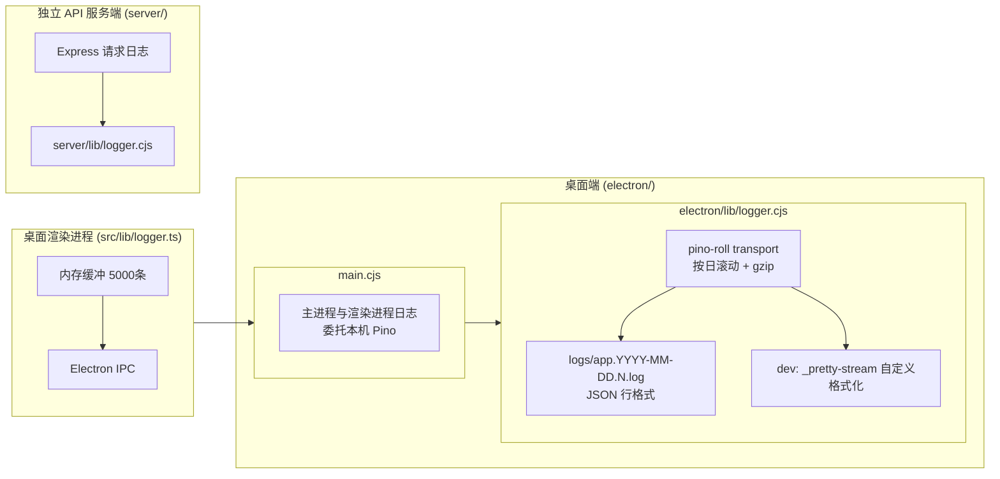

# 🌍 地球 Online 生存日记

> 以「地球 Online 玩家」的身份管理生活，3D 可视化呈现你的生存轨迹。

一款将游戏化概念融入日常时间管理的 Windows 桌面应用。记录足迹、管理任务、专注计时、规划课程，并通过云端 API 存取数据。

## ✨ 功能模块

| 模块 | 说明 |
|------|------|
| 👣 足迹记录 | 记录每日活动与日记，上午/下午/晚上三列并排展示，星标全宽置顶；卡片按钮始终可见且独立配色 |
| 📝 笔记 | Milkdown 所见即所得 Markdown 编辑器；底部状态栏集中大纲、反向链接、导出、源码与收藏操作，并显示精确到分钟的创建和更新时间；支持幻灯片放映 |
| ⏱️ 专注计时 | 番茄钟与正计时，完成后自动生成足迹 |
| 📋 清单 | 智能清单与任务管理，支持分组、优先级、重复任务；卡片按钮始终可见且独立配色 |
| 🚀 倒数日 | 重要日期追踪，系统自动生成节日倒数日 |
| 📚 课程表 | 教学周与节次管理，自动课程提醒 |
| 📊 统计 | ECharts 图表展示时间分布 |
| 🧰 工具箱 | 数据导入导出、插件入口 |
| 🔌 插件系统 | 可扩展插件，市场托管在独立仓库 |

应用内置新手引导（首次启动自动播放）与应用内「使用指南」笔记（笔记模块 → 攻略分类），README 侧重开发相关内容。

## 🔌 插件市场

应用内置社区插件市场，可在工具箱页面查看与安装。插件列表托管在独立仓库：[XueWerY/plugin-marketplace](https://github.com/XueWerY/plugin-marketplace)

## 🖥️ 支持平台

- **Windows** — Electron 桌面端

## 🛠️ 技术栈

- **前端**：Vue 3 + TypeScript + Composition API + Pinia + Vue Router
- **UI**：Element Plus + 深色星空主题 + Lucide 图标（`@lucide/vue`，与 Element Plus 图标统一为线性风格）
- **字体**：Noto Sans SC（思源黑体，正文）+ JetBrains Mono（计时器数字 / 代码，经 Fontsource 自托管）
- **动效**：GSAP（卡片逐个出现·行优先顺序、倒数日数字滚动，尊重系统减少动态效果偏好）
- **编辑器与图表**：Milkdown（Crepe，ProseMirror 内核）· ECharts · lunar-javascript（农历）
- **客户端**：Electron（Windows 桌面）
- **日志与提醒**：桌面端 Pino 日志独立写入本机；提醒运行在 Electron 主进程并通过云端 API 持久化
- **构建**：Vite + electron-builder

## 🚀 开发环境

### 基础环境

- Node.js 18+（推荐 20 LTS）
- pnpm（`npm install -g pnpm`）
- TypeScript 5.8+（随项目依赖安装）

```bash
# 安装依赖
pnpm install
```

Electron 端依赖在 `electron/` 目录通过 `electron/package.json` 管理，由构建脚本 `install-deps` 步骤自动安装；打包时该目录的 `node_modules` 作为 `extraResources` 复制到应用 `resources/node_modules`，`logger.cjs` 在 asar 内 `require('pino')` 失败时回退从该目录加载。

### 浏览器调试

可单独启动 Vite 预览页面进行界面调试；浏览器预览和正式桌面客户端均固定访问 `https://www.earth-survival-diary.icu` 的 API。业务数据经独立运行的云端 API 存取。

```bash
npx vite
```

- Chrome DevTools（F12）断点、Network、IndexedDB 查看
- Vue DevTools 浏览器插件查看组件树与 Pinia 状态
- Vite 自动 HMR，无需手动刷新
- **注意**：浏览器端无法调试 Electron 主进程，Electron 相关改动需在桌面端验证

### Electron 桌面端开发

`pnpm dev` 只启动 Vite dev server（端口 5173）和 Electron 客户端，不会启动服务端或转发 `/api` 请求。登录和注册界面直接访问内置的 HTTPS API 地址 `https://www.earth-survival-diary.icu`。

```bash
pnpm dev
```

| 改动类型 | 行为 |
|----------|------|
| `src/**/*.vue`、`src/**/*.ts` | Vite HMR 即时刷新页面，不重启 Electron |
| `electron/**/*.cjs`（主进程 / preload） | `scripts/dev.cjs` 监听文件变化，杀掉 Electron 进程树（`taskkill /T /F`）后重新拉起 |

主进程日志输出到终端与 `userData/logs/app.YYYY-MM-DD.N.log`，渲染进程可通过 `mainWindow.webContents.openDevTools()` 打开 DevTools。

### 云端数据服务器部署

客户端和服务端现在分别发布：桌面安装包仍由根目录 `electron:build:win` 构建；云服务器只部署精简 API 包，不需要完整客户端源码。服务端包只包含 API 入口、API 路由、本地 YAML 文件存储、笔记迁移和运行所需依赖清单，不包含 Vue 前端、Electron 主进程或用户数据目录。

在 Windows Server 2025 上部署时，先在开发机的完整项目根目录运行 `npm run server:package`。它会按当前版本号生成 `release/server-<版本号>/`；将这个目录上传到服务器即可，避免把整个项目传上去。服务端包内有独立的 `package.json` 和部署说明；在服务器包目录运行 `npm install --omit=dev` 安装 API 所需的精简生产依赖。

服务端不依赖数据库。业务数据以 YAML 文件保存在 `ESD_DATA_DIR`，建议设置为部署目录之外的 `C:\ProgramData\EarthSurvivalDiary\data`，并限制为服务账号可读写。重新部署服务端包时保留此目录并定期备份。

API 需要配置 `PORT=5000`、`HOST=127.0.0.1`、`ESD_DATA_DIR` 和至少 32 字符的随机 `ESD_JWT_SECRET`。首次可在 PowerShell 中设置这些变量并运行 `npm start`；长期运行时再把它配置成自动启动的 Windows 服务。JWT 密钥不要写入客户端、服务端包或 Git。

给 API 准备 HTTPS 域名，并把该域名的 DNS A 记录指向云服务器 `101.43.31.173`。在服务器配置 HTTPS 证书和反向代理，把外部 HTTPS 请求转发至 `http://127.0.0.1:5000`；公网只开放反向代理所需的端口，不直接开放 API 5000。确认 `https://你的域名/api/health` 返回 `{"status":"ok","storage":"yaml"}`。

桌面端登录和注册会直接访问内置的 HTTPS API 地址 `https://www.earth-survival-diary.icu`。若要沿用旧数据，先备份，再按 `server/README.md` 所述迁移；新服务器不会自动读取客户端本机数据。

云端服务会拒绝无签名的旧登录令牌；迁移账号后，首次登录需要重新输入密码。旧版 SHA-256 密码会在首次成功登录时自动升级为带盐 scrypt 哈希。桌面端不启动或捆绑 API 服务及服务端数据目录。

**数据共享范围**：清单（含分组）、清单任务、足迹日记（任务+日记）、倒数日、课程表、笔记（含分类）、专注记录/常用专注 —— 所有模块与桌面端字段一一对应并互相可见。

**账号说明**：桌面端使用云端账号体系（`ESD_DATA_DIR/users/<邮箱编码>.yaml`）的邮箱+密码登录，`access_token` 存本地缓存，401 时自动跳回登录页。

### 注意事项

- 浏览器预览仅用于界面调试；桌面客户端通过云端 API 存取账号与数据
- `vite.config.ts` 中 `base: './'` 确保打包后资源路径正确，请勿修改
- `virtual:version` 虚拟模块在构建时从 `package.json` 注入版本号

## 📁 项目结构

```
earth-survival-diary/
├── src/                        # 前端源码
│   ├── components/             # Vue 组件（按模块组织）
│   │   ├── auth/               #   认证页面
│   │   ├── common/             #   通用组件（nav、card、overlay、picker）
│   │   ├── ui/                 #   通用 UI 组件（BaseDialog、ColorGrid）
│   │   ├── editor/             #   MilkdownEditor（Milkdown/Crepe）
│   │   ├── timer/              #   FloatingTimerBar
│   │   ├── countdown/          #   倒数日
│   │   ├── course/             #   课程表
│   │   ├── focus/              #   专注计时
│   │   ├── footprint/          #   足迹记录
│   │   ├── list/               #   清单
│   │   ├── notes/              #   笔记
│   │   ├── profile/            #   个人中心
│   │   ├── statistics/         #   统计
│   │   └── toolbox/            #   工具箱
│   ├── composables/            # 组合式函数
│   ├── data/                   # 静态数据（引导步骤、使用指南 Markdown）
│   ├── lib/                    # 工具库（API、存储、日志、文件系统、插件桥接）
│   ├── plugins/                # 插件系统（Vite glob 加载）
│   ├── router/                 # 路由配置
│   ├── services/               # 存储服务（storageService）
│   ├── stores/                 # Pinia 状态管理
│   ├── types/                  # 类型声明（含 electron.d.ts IPC 类型）
│   ├── App.vue                 # 根组件
│   └── main.ts                 # 入口文件
├── electron/                   # Electron 主进程
│   ├── main.cjs                #   入口，IPC handler、窗口管理、子进程
│   ├── preload.cjs             #   contextIsolation 桥接，window.electronAPI
│   ├── lib/logger.cjs          #   桌面端独立 Pino 日志
│   └── build-plugin.cjs        #   插件系统编译（esbuild）
├── server/                     # 与客户端分开启动和部署的 API 服务端实现
│   ├── index.cjs               #   云端服务启动入口
│   ├── prod-server.cjs         #   Express API 路由
│   └── lib/                    #   YAML 文件存储、服务端日志与笔记迁移模块
├── scripts/                    # 构建工具脚本（dev.cjs、build-tools.cjs、generate-icons.js）
├── quick-capture.html          # Electron 全局速记窗口页面
├── build/                      # 图标资源（app-icon.png 源文件）
├── public/                     # 静态资源
└── package.json                # 项目配置
```

## 📐 技术架构

### 主进程能力（IPC）

渲染进程与插件**不得直接使用 Node 能力**（`contextIsolation: true` / `nodeIntegration: false`），所有系统能力统一由 `electron/preload.cjs` 挂到 `window.electronAPI`，实现放在 `electron/main.cjs` 的 `ipcMain.handle`，类型在 `src/types/electron.d.ts` 同步声明（三处需一并修改）。

主要 IPC：

| IPC | 说明 |
|-----|------|
| `execPowerShell(command)` | 执行 PowerShell 命令，stdout/stderr 经 `powershell-output` 事件流式回推；主进程已统一 UTF-8 编码 |
| `startSnowbaby` / `stopSnowbaby` | snowbaby 常驻进程管理（`child_process.spawn('node', ['app.js'])`，注入 `ESD_DATA_DIR`，`taskkill /T` 停止） |
| `napcat*` 系列 | NapCat Shell 手动版管理（get/status/download/install/start/stop/update/uninstall/checkQQ），仅 Windows AMD64 |
| `openDirectory()` | 系统目录选择对话框（NapCat 手动指定 QQ 安装目录用） |
| `httpGetJson(url)` / `httpGetText(url)` | 主进程发起 HTTPS 请求（绕开渲染进程同源策略）；插件市场下载 GitHub 源文件统一走此通道 |
| 日志 IPC | `get-log-file-size` / `get-log-content` / `clear-logs`（适配 pino-roll 滚动文件） |

### 插件系统架构

- 仅支持 Electron 端，以源码形式分发（插件市场从 GitHub 下载源码），**不打包进 exe**
- **开发模式**：`src/lib/pluginLoader.dev.ts` 通过 Vite glob 加载 `src/plugins/<插件ID>/`
- **生产模式**：插件安装到 `userData/plugins/<插件ID>/`；应用启动时主进程用 esbuild 打包为单文件 ESM（`dist/<工具ID>.js`），Electron 通过受限 IPC 读取插件模块并动态导入，不依赖服务端静态路由
- **运行时桥**：共享依赖（vue / pinia / element-plus / 应用内部模块等）**不打包进插件产物**，由 `src/lib/pluginBridge.ts` 暴露到 `window.__ESD_BRIDGE__`，保证插件与主应用共用同一实例
- **桥接白名单**：新增可桥接模块需同步修改 `electron/build-plugin.cjs`（`BARE_BRIDGE` / `SRC_BRIDGE`）与 `src/lib/pluginBridge.ts` 两处，键名必须与插件内实际 import 路径一致
- 编译标记 `dist/.compiled` 内容版本化（`main.cjs` `COMPILED_TAG`），打包器变更时递增强制重编译

```
<插件ID>/
├── plugin.json                 # manifest + tools 元数据
├── index.ts                    # 仅开发模式（Vite glob）使用
├── tools/<工具ID>/index.vue    # 工具组件（script setup）
└── dist/                       # 生产模式启动时自动生成
    ├── <工具ID>.js
    └── .compiled               # 编译标记（内容 = COMPILED_TAG）
```

## 📝 日志系统

桌面端与云端 API 使用各自独立的 Pino 日志实例。桌面渲染进程 `src/lib/logger.ts` 通过 IPC 把日志写入 Electron 主进程的本机滚动日志；API 服务端只记录自己的服务日志。

### 架构


```mermaid
flowchart LR
    subgraph Frontend["桌面渲染进程 (src/lib/logger.ts)"]
        direction TB
        F1[内存缓冲 5000条] --> F2["Electron IPC"]
    end

    subgraph Node["桌面端 (electron/)"]
        direction TB
        subgraph DesktopLogger["electron/lib/logger.cjs"]
            P[pino-roll transport<br/>按日滚动 + gzip]
            P --> FILE[logs/app.YYYY-MM-DD.N.log<br/>JSON 行格式]
            P --> PRETTY[dev: _pretty-stream 自定义格式化]
        end

        subgraph Main["main.cjs"]
            direction TB
            MD[主进程与渲染进程日志<br/>委托本机 Pino]
        end
    end

    subgraph API["独立 API 服务端 (server/)"]
        direction TB
        S1[Express 请求日志] --> S2[server/lib/logger.cjs]
    end

    Frontend --> Main
    Main --> DesktopLogger
```

### 行为

| 模式 | 级别 | 输出 |
|------|------|------|
| dev（`ESD_DEV_URL` 存在） | `debug` | pino-roll 文件 + _pretty-stream 彩色格式化 stdout（自定义格式） |
| prod | `info` | 仅 pino-roll 文件（无 stdout target） |

- **Express 请求**：原生中间件 `res.on('finish')` 捕获，输出简洁单行 `[HTTP] 接口 POST /api/xxx 返回 200 (2ms)`；跳过 `/api/health` 高频轮询
- **滚动策略**：pino-roll 按日生成 `app.YYYY-MM-DD.N.log`，旧文件自动 gzip 压缩
- **日志查看**：Toolbox → Logs，底层用 findLatestLogFile() 取最新文件


- **stdout 格式化（dev only）**：自定义 `_pretty-stream.cjs` Transform stream，格式为
  ```
  [HH:mm:ss.l] [LEVEL ] [  名称  ] 消息内容
  ```
  三段独立颜色（时间灰、级别各有、名称蓝），级别标签 padEnd 5、名称段居中 pad 12
  后再包 `[]`，名称从 msg 中正则提取 `/^\[([^\]]+)\]\s*/`

### 提醒调度系统

| 组件 | 位置 | 说明 |
|------|------|------|
| 持久化存储 | `userData/data/<userId>/system/reminders.json` | JSON 文件，防抖 3 秒落盘 |
| ticker 扫描器 | main.cjs `scanDueReminders()` | 每 60s 扫存储，捡 5 分钟内到期的注册 setTimeout |
| 双通道触发 | main.cjs `showNextReminder()` | 主窗口可见 → 应用内弹窗，否则 → `new Notification()` 系统通知 |
| 循环提醒 | main.cjs `scheduleNextRepeat()` | 触发后写存储让 ticker/setTimeout 自动捡 |
| 启动恢复 | main.cjs `initReminderSystem()` | 读 JSON + 补触发期间过期提醒 |
| 退出保险 | `before-quit` | `cancelAllReminderTimers()` + `stopTicker()` + `persistReminders()` |

## 🎨 UI/UX 规范

### 视觉风格

- **配色**：深色星空背景、蓝紫渐变（`#667eea`）、琥珀强调（`#fbbf24`）
- **笔记编辑器配色**：内容区与外围统一蓝紫主题——主色 `#667eea`（rgba `102,126,234`）、标题/链接/行内代码强调 `#93c5fd`、高亮 `#c4b5fd`、代码亮字 `#eef2ff`、正文 `#cbd5e1`、次级文字 `#94a3b8`/`#7d8db5`/`#5d6b94`、弹层底 `rgba(23,22,48,.98)`；代码高亮 `built_in` 同步为 `#c4b5fd`；长图导出（`noteExport.ts`）主题同步蓝紫
- **可读性强调色**：编辑器光标（`caret-color: #a78bfa`）与无序列表项目符号（`#d8b4fe`）采用紫色系；列表符号/缩进以全局 `<style>` 注入并覆盖 Crepe ListBlock 组件（bullet 在 `.label-wrapper` 内、颜色走 `--crepe-color-outline` 变量，非 `::marker`），符号 `#e9d5ff`（与光标 `#a78bfa` 区分）、label 宽 24→16px、项间距 10→4px；收起大纲按钮为紫系圆形（PanelLeftClose），展开按钮为紫系胶囊（ListTree）；状态栏右侧集中大纲、反链、导出、源码、收藏与全屏编辑操作；无序列表缩进收窄至 18px
- **文字**：rgba 白色透明度梯度，深色背景下 clear 可读
- **图标**：Lucide 线性图标（`@lucide/vue`），`el-icon` 内经 CSS 统一为 `1em` 跟随字体尺寸
- **动效**：GSAP 卡片逐个出现（行优先顺序、防抖合并收敛；仅在切换视图、卡片新增/删除/标记完成时触发，卡片内容编辑保持静态），全程仅使用 `transform/opacity`，全局遵循 `prefers-reduced-motion` 降级

### 布局

- 面包屑地址栏导航，支持下拉快速切换模块
- **笔记模块例外**：左侧双栏（左导航 220px / 中列表 300px / 右编辑器自适应），全局导航栏保持可见，模块切换入口置于左栏顶部，状态栏「全屏编辑」按钮可移除/恢复左侧双栏（导航+列表，`display:none`），全屏编辑时全局导航一并隐藏；大纲与反链面板默认收起；窄屏两档降级——`<1100px` 左栏变抽屉、`<900px` 退为列表优先 + 编辑器整屏下钻
- 卡片网格布局，响应式列数（全局最多 6 列；清单页、倒数日页、课程表列表视图例外：最多 3 列，卡片间距与左右边界留白均为 25px）
- 支持分屏显示（左右双面板，`splitActive` 状态下每个面板含独立导航区）

### 交互

- 卡片操作按钮（完成/编辑/删除/星标）始终显示在右上角标题一行，独立配色
- 下拉菜单使用固定定位 + backdrop-filter 模糊背景
- 确认操作使用 `ConfirmDialog`，消息提示使用 `ElMessage`

### 常用组件

| 组件 | 说明 |
|------|------|
| `MainNav` | 桌面端左侧图标导航区，宽 64px、项自顶部对齐，悬停显示模块名 |
| `BaseDialog`（`components/ui/`） | 通用弹窗。内容区可滚动，`#footer` 插槽固定底部按钮带分隔线；`noOverlayClose` 禁止点击遮罩关闭 |
| `ConfirmDialog` | 确认弹窗，v-model:visible 控制；message 下方提供默认插槽放额外内容（如勾选项） |
| `ReminderCard` | 提醒卡片，每 5 秒弹出 |
| `FloatingTimerBar`（`components/timer/`） | 计时中跨页面常驻弹窗，窗口右下角，可拖动 |
| `GuideOverlay` | 新手引导遮罩层 |
| `ColorPickerPanel` | 颜色选择面板，自带 max-height: 90vh + overflow-y: auto |

## 🏗️ 构建与部署

### Windows 桌面端

```bash
pnpm electron:build:win
# 流程：清理桌面产物（保留 server-* 服务包）→ vite build → 安装依赖 → 生成图标 → electron-builder
```

### 应用图标

```
build/app-icon.png（源文件）
  │
  ├─► scripts/generate-icons.js（sharp）
  │   └─► build/icon.png(512) ~ icon-16.png   → 桌面端
  │
  └─► scripts/build-tools.cjs make-ico
      └─► build/icon.ico                      → Windows 安装包
```

更换图标：替换 `build/app-icon.png` 后重新构建即可。

### 发布

```bash
# 本地构建（不发布）
pnpm electron:build:win

# 发布到 GitHub Releases（自动打 tag + 上传产物）
# 前置：设置环境变量 GH_TOKEN（GitHub Personal Access Token，需要 repo 权限）
pnpm electron:build:win:release
```

**更新链路**：

- **发布侧**：`electron-builder` 自动打包 NSIS 安装包 `.exe`、差分更新 `.blockmap`、元数据 `latest.yml`，以 release tag（如 `v2026.9.16-1`）上传到 GitHub Releases
- **运行时**：`electron-updater`（provider: github）从 GitHub Releases API 读取 `tag_name` 作为最新版本号和安装包地址，不依赖文件名正则
- **触发时机**：启动 5s 后自动检查一次 + 每 6 小时静默轮询 + 用户手动触发
- **完整流程**：检查 → 提示有更新 → 用户点下载（显示进度）→ 下载完成提示重启 → 用户确认后 `quitAndInstall` 自动重启安装
- **IPC 入口**：`check-for-update` / `download-update` / `quit-and-install`，状态通道 `update-status` 推送 `checking / available / no-update / downloading(percent) / downloaded / error`

## 🔒 数据管理

### 存储架构

| 平台 | 方式 |
|------|------|
| Electron（桌面） | 独立客户端；正式版通过 HTTPS 访问云端 API，开发时也需连接单独启动的 API 服务 |
| 隔离 | 按用户 ID 分目录保存 YAML 文件；账号索引与全局设置各自单独保存 |

### YAML 文件布局

| 路径 | 内容 | 说明 |
|------|------|------|
| `users/<邮箱编码>.yaml` | 账号、密码哈希和昵称 | 账号独立文件 |
| `<用户ID>/<模块>/<键>.yaml` | 个人资料、设置、足迹、清单、笔记等模块 | 单例模块保存对象，记录模块保存有序数组 |
| `settings/settings.yaml` | 应用全局设置 | 与账号模块分开 |
| `<用户ID>/notes-migration-backup-*.yaml` | 笔记分类迁移前快照 | 用于回溯 |

文件写入先写临时文件再原子替换，笔记记录级新增、修改和删除会串行落盘。API 形状保持不变，调用方无需感知文件拆分。

### 关键数据路径

| 数据 | YAML 路径 |
|------|------|
| 窗口分辨率 / 设置 | `<用户ID>/settings/settings.yaml` |
| 笔记 / 标签 | `<用户ID>/notes/notes.yaml` / `<用户ID>/notes/tags.yaml` |
| 足迹任务 / 日记 | `<用户ID>/footprint/footprint.yaml` / `<用户ID>/footprint/diary.yaml` |
| 清单 / 清单任务 | `<用户ID>/list/lists.yaml` / `<用户ID>/list/tasks.yaml` |
| 清单文件夹 / 收藏 / 完成记录 | `<用户ID>/list/folders.yaml` / `favorites.yaml` / `completed.yaml` |
| 笔记置顶 | `<用户ID>/notes/notes.yaml` 中的 `pinned` 字段 |
| 倒数日 / 分类 | `<用户ID>/countdown/countdowns.yaml` / `categories.yaml` |
| 课程表 | `<用户ID>/course/courses.yaml` |
| 专注记录 / 常用专注 | `<用户ID>/focus/records.yaml` / `favorites.yaml` |
| 系统状态 / 提醒 | `<用户ID>/system/state.yaml` / `reminders.yaml` |
| 插件 / 历史数据 | 不再存储（迁移时跳过） |

`storageService` 使用内存缓存（Map）减少重复请求，`clearCache()` 可清除。

### 笔记数据模型（标签体系）

笔记由「单一分类」改为「多标签」：

```
Note { id, title, content, tagIds[], pinned, trashedAt, createdAt, updatedAt }
Tag  { id, name, color, order }        // name 支持 "项目/子项目" 嵌套
```

- **迁移**：应用启动时自动执行（`server/lib/notes-migration.cjs`），幂等。每个旧分类转为同名标签并复用其 id，笔记的 `categoryId` 写入 `tagIds[0]`，正文零改动；迁移前会写一份原始快照到 `用户数据目录/<用户目录编码>/notes-migration-backup-<时间戳>.yaml` 以便回溯。
- **嵌套标签**：`name` 支持 `项目/子项目` 层级。创建时自动补建缺失的祖先标签；重命名级联更新后代路径前缀；重名视为冲突；删除仅移除该标签本身（笔记保留），后代标签在树中重挂到灰色的虚拟父节点下（仍可点击聚合查看）。
- **父标签聚合**：点击父标签 = 汇总自身 + 全部后代的笔记（按路径前缀匹配）；笔记只归属实际被打的标签，聚合仅在查看时展开。
- **编辑布局**：顶部仅显示标题与标签 chips（× 移除）及标签选择器（联想已有标签、输入即建新标签、↑↓/回车键盘导航）；底部状态栏显示字数、统一格式的创建/更新时间（`YYYY-MM-DD HH:mm`），并集中大纲、反向链接、导出、源码/富文本切换、收藏、自动保存和全屏编辑操作；`Ctrl+Shift+T` 聚焦标签输入。
- **全文搜索**：前端内存倒排索引（`src/utils/bigramSearch.ts`）——CJK 按单字+相邻双字切分求交、纯 ASCII 走原文子串（支持前缀）、混合查询 token AND + 原文校验；检索范围为标题 + 正文纯文本 + 标签名，含回收站笔记。
- **自动保存**：输入防抖 800ms 落库；切换/关闭笔记、组件卸载、窗口隐藏（`visibilitychange`）时强制落库未保存修改；状态栏显示「已自动保存 HH:mm:ss」；保存按钮已移除。
- **源码模式**：状态栏切换所见即所得 / Markdown 源码（等宽 textarea，Tab 插入两个空格），大纲与字数在两种模式下均实时可用。
- **回收站**：删除先软删除（`trashedAt`），保留 30 天，启动时自动清理过期项；回收站支持单条恢复 / 彻底删除 / 一键清空（均带确认）。
- **双向链接**：自建 `[[ ]]` wiki-link 插件（`src/components/editor/wikiLink.ts`，基于 `@milkdown/kit` 的 `$remark`/`$nodeSchema`/`$inputRule` 原语）——存储为纯 `[[目标|别名]]` 语法（直接兼容 Obsidian / Logseq）；输入 `[[` 弹出笔记标题联想（↑↓/Enter/Esc 键盘导航），chip 点击跳转，未解析链接（虚线样式）点击即以目标为标题创建新笔记；反链面板列出引用当前笔记的来源（标题 + 所在行摘录），通过状态栏按钮展开或收起。
- **导出**：状态栏「导出」下拉——① Markdown（`.md`）：YAML frontmatter 携带 title/tags/created/updated，正文原样保留 `[[ ]]` 语法，可直接迁入 Obsidian / Logseq；② 长图（`.png`）：编辑器渲染产物克隆到离屏容器 + 自包含蓝紫暗色排版样式 + html2canvas（720px 宽 @2x）。应用级「设置 → 数据导出/导入」自本版本起包含笔记与标签（`/api/export` / `/api/import`）。
- **每日笔记**：标题为当天日期（`YYYY-MM-DD`）的普通笔记 + 自动创建的「每日」标签；「今日」视图空态提供「新建今日笔记」入口（当日已有则直接打开）；`Ctrl+N` 新建普通笔记。
- **全局速记捕获窗**：无边框置顶小窗（480×190，`normal` 层级不遮挡全屏应用），应用启动即常驻，可拖动、位置记忆（多显示器可见性校验）；默认快捷键 `Ctrl+Shift+Q` 全局呼出/隐藏（「我的 → 系统设置」可换键，被占用时托盘气泡提示）；页面为独立桌面 HTML（`quick-capture.html`），开发和打包均由 Vite 构建；请求由 Electron 主进程通过受限 IPC 发往云端 API，不依赖本机 Express 或共享 localStorage 登录令牌；支持新建速记和追加到今日笔记；Enter 保存 / Shift+Enter 换行 / Esc 隐藏；草稿保存在 localStorage；写入走记录级笔记 API，与主窗口无并发覆盖；主窗口聚焦与进入笔记页时自动同步云端变更（`noteStore.syncFromRemote`）。
- **置顶**：由 `notes:favorites` 键改为笔记自身的 `pinned` 字段。该键此前被「置顶 id」与「导航收藏对象」两种语义复用、互相覆盖，迁移后仅保留导航收藏用途。
- **写入方式**：笔记改用记录级读写 `GET/POST /api/notes`、`PATCH/DELETE /api/notes/:id`，不再「整份数组读-改-写」——全局捕获窗口与主窗口同时写时，整份写回会抹掉对方的新增/修改。
- **过渡期兼容**：桌面端 `noteStore` 额外派生出 `categoryId`（等于 `tagIds[0]`）与 `categories` 视图，供尚未重写的旧笔记界面读取。

### 迁移旧 MySQL 数据

新服务端运行时不连接 MySQL。若旧服务端已经在 MySQL 中保存了账号或业务数据，先备份 YAML 目标目录，在完整源码根目录设置旧库的 `ESD_MYSQL_*` 环境变量和目标 `ESD_DATA_DIR`，再运行一次性导入工具。目标目录中存在同邮箱账号时，脚本默认拒绝覆盖；确认备份后可添加 `--overwrite`。

```powershell
$env:ESD_DATA_DIR = 'C:\ProgramData\EarthSurvivalDiary\data'
npm run data:migrate:mysql-to-yaml
# 确认覆盖目标目录中的同邮箱账号后：
npm run data:migrate:mysql-to-yaml -- --overwrite
```

导入后先检查 YAML 文件和账号登录，再停用 MySQL。旧 JSON 文件存储可由 YAML 存储层按需读取；后续写入会保存为 YAML 文件。

## 📄 许可

[LICENSE](./LICENSE)
